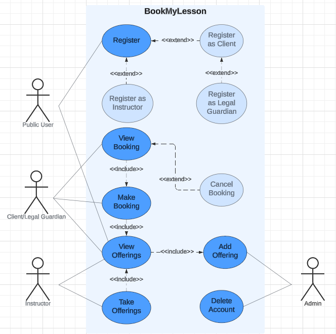

# BookMyLesson

## Introduction
BookMyLesson is a lesson management system designed to help organizations offer group and private lessons, such as yoga and swimming, across multiple locations. The system allows instructors to register and take on lesson offerings, while clients can browse, book, and manage their lessons. It includes a flexible scheduling system for various types of lessons, handles bookings and availability, and supports legal guardians booking on behalf of underage clients. Administrators can manage offerings and oversee system operations.

## UML Use Case Diagram

## Team Members
Syed Ayaan Jilani (40209519)
Mario Thomas Esposito (40205337)
